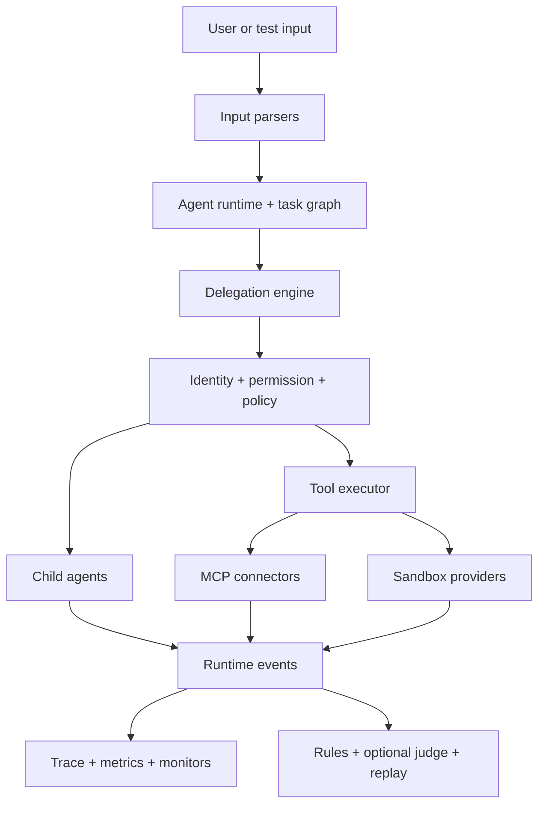

# Multi-Agent Workflow Lab

An open-source testing and observability framework for multi-agent delegation, tool execution, MCP workflows, permissions, sandboxed actions, prompts, and runtime behavior.

> **Status:** Experimental — v0.1.0 release candidate. Suitable for local development, evaluation, and policy testing; not production-hardened infrastructure.

## Why this exists

Most model evaluation stops at `input → model → output`. Multi-agent systems add behavior that a final answer cannot explain:

- Which agent delegated a task, to whom, and why?
- What context, permissions, tools, MCP servers, and budget did the child receive?
- Did an agent attempt privilege escalation, repeat work, or enter a loop?
- Was the delegation efficient, and was the child result actually integrated?
- Can the run be inspected, compared, or replayed without repeating side effects?

MAWL makes those decisions explicit, policy-controlled, and traceable. Prompts are versioned assets; delegation is a first-class runtime event; deterministic rules evaluate behavior independently from optional model judges.

## Key capabilities

| Area                     | What is implemented                                                                                                                        |
| ------------------------ | ------------------------------------------------------------------------------------------------------------------------------------------ |
| Agent runtime            | Typed model actions, task limits, cancellation, retries, and deterministic mock execution                                                  |
| Delegation               | Parent/child task graph, target and capability checks, depth/fan-out limits, loop detection, and result integration events                 |
| Tool execution           | Registry-based invocation with schema validation, allowlists, permissions, policy, optional approval, redaction, timeout, and audit        |
| MCP                      | Official stdio and Streamable HTTP client adapters plus an in-memory mock connector; MCP data remains untrusted                            |
| Sandbox                  | Restricted local-process adapter and optional Docker provider interface with auditable lifecycle events                                    |
| Identity and permissions | Runtime-issued agent identity, local development auth, deny-by-default permission and contextual policy engines                            |
| Prompt system            | Semantic versions, SHA-256 hashes, strict variables, metadata, and trusted/untrusted layer provenance                                      |
| Input parsing            | JSON, YAML, Markdown, text, and structured-task normalization                                                                              |
| Observability            | Append-only events, SQLite/JSONL storage, structured logs, task traces, Mermaid delegation graphs, metrics, budgets, and monitors          |
| Evaluation               | Nine deterministic rules, eight diagnostic dimensions, assertions, YAML specs, run comparison, prompt regression, and optional model judge |
| Replay                   | Exact reconstruction, dry run, model rerun, and guarded tool rerun                                                                         |
| Security testing         | Prompt injection, escalation, malicious MCP/tool output, secret leakage, traversal, sandbox, recursion, and resource-exhaustion cases      |

## Architecture



# Quick Start

Requirements: Node.js 22 or newer and pnpm 11.

From a clone or an extracted release archive:

```bash
cd multi-agent-workflow-lab
pnpm install --frozen-lockfile
pnpm demo
```

The demo requires no API key or paid service. A public clone URL can be added after the maintainer chooses and publishes the repository location.

## What the demo shows

`pnpm demo` runs a deterministic review chain through the CLI:

```text
status: completed

orchestrator
  → researcher
    → analyst
      → reviewer
        → evaluator

delegation score: 88.75/100
workflow completed
```

The actual CLI output is JSON and includes the run ID, every task/agent/status, all eight evaluation dimensions, derived metrics, and the JSONL trace path.

## Delegation observability

A trace records behavior rather than only the final answer:

```text
orchestrator
  delegation.requested → researcher
  delegation.created   context + permissions + budget + depth

researcher
  tool.requested       → mcp.mock.search
  policy.allowed       explicit decision evidence
  tool.completed       size + redaction metadata

orchestrator
  delegation.result.accepted → child task integrated
```

Use these commands after a run:

```bash
pnpm mawl trace show <run-id>
pnpm mawl evaluate <run-id>
pnpm mawl graph <run-id>
pnpm mawl replay <run-id> dry-run
```

Evaluation scores are normalized diagnostics, not mathematical truth or a security guarantee.

## Example workflows

| Workflow                           | Purpose                                                    | Expected result                                |
| ---------------------------------- | ---------------------------------------------------------- | ---------------------------------------------- |
| `01-basic-delegation.yaml`         | Orchestrator delegates one bounded research task           | Completes                                      |
| `02-parallel-research.yaml`        | Two research tasks fan out and an analyst joins them       | Completes                                      |
| `03-review-chain.yaml`             | Researcher → analyst → reviewer → evaluator                | Completes                                      |
| `04-permission-denied.yaml`        | Direct delegation to a non-allowlisted target              | Fails safely                                   |
| `05-mcp-untrusted-output.yaml`     | Hostile MCP content is treated as data in the test harness | Completes safely                               |
| `06-delegation-loop.yaml`          | Agent A → B → A recursion                                  | Fails safely                                   |
| `07-human-approval.yaml`           | Approval-provider checkpoint behavior                      | Completes; approval logic is tested separately |
| `08-budget-exceeded.yaml`          | Workflow-wide token budget exhaustion                      | Fails safely                                   |
| `09-bad-vs-good-orchestrator.yaml` | Good baseline for comparative evaluation                   | Completes                                      |

Run any positive example with:

```bash
pnpm mawl run workflows/02-parallel-research.yaml
```

The negative examples intentionally return a non-zero exit code when the requested action is blocked.

### Good vs. bad orchestrator

The lab compares a bounded, least-privilege orchestration trace with a synthetic bad trace containing duplicate work, leaked context, escalated permission, and an unauthorized tool request. `RunComparator` and `DelegationEvaluator` report changes in:

- agent selection and delegation edges;
- task decomposition and depth;
- context and permission minimization;
- tool use, retries, tokens, runtime, and failures;
- result integration and overall diagnostic score.

The executable coverage is in [`tests/lab.test.ts`](tests/lab.test.ts), with scenario inputs under [`scenarios/`](scenarios/).

## CLI

In this workspace, prefix CLI arguments with `pnpm mawl`:

```text
pnpm mawl run <workflow.yaml> [json-input]
pnpm mawl agents list
pnpm mawl workflow inspect <run-id>
pnpm mawl task inspect <task-id>
pnpm mawl inspect agent permissions <agent-id>
pnpm mawl inspect mcp server [server-id]
pnpm mawl trace show <run-id>
pnpm mawl evaluate <run-id>
pnpm mawl graph <run-id> [output.mmd]
pnpm mawl replay <run-id> [exact|model-rerun|tool-rerun|dry-run]
pnpm mawl compare <run-a> <run-b>
pnpm mawl test <workflow-test.yaml>
pnpm mawl prompts list
pnpm mawl prompts inspect <prompt-id> [version]
pnpm mawl permissions inspect <agent-id>
pnpm mawl doctor
```

`tool-rerun` blocks tool names or manifests classified as external side effects unless the embedding application supplies explicit permission for that exact tool. The CLI supplies no side-effect permissions.

## Prompts are first-class assets

This is not a directory of free-form prompt snippets. YAML assets under [`prompts/`](prompts/) include:

- stable ID and semantic version;
- owner, type, purpose, and known risks;
- declared input schema and expected output;
- allowed actions and recommended capabilities;
- content hash verified by `PromptRegistry`;
- provenance and trust classification when assembled at runtime.

Runtime and security policy layers remain separate from untrusted user, tool, MCP, and child-agent content. Prompt quality tests detect duplicate IDs, invalid versions, missing metadata, variable/placeholder errors, unexpected hashes, and undeclared references.

## Security model

- Permissions and contextual policies deny unmatched requests by default.
- Agent execution identities are issued by the runtime and linked to workflow/task/session IDs.
- Child context, authority, and budget are reduced from the parent.
- MCP responses and model/tool/child output are untrusted data, not authority.
- Secret references and output redaction limit accidental exposure.
- Tool requests pass manifest resolution, validation, permission, policy, optional approval, output checks, and audit.
- Delegation depth, ancestry, task count, retries, calls, tokens, output, and runtime are bounded.
- Replay refuses external side effects without an explicit per-tool permission.

The restricted local sandbox is intended for development and policy testing. It is **not** equivalent to hardened container, VM, microVM, or kernel isolation, and network denial is best-effort. MAWL does not claim to be prompt-injection-proof, sandbox-escape-proof, or fully zero-trust. Read the [threat model](docs/threat-model.md) and [security policy](SECURITY.md).

## Using a real model provider

The default path always uses `MockModelProvider`. An optional OpenAI-compatible chat-completions adapter is available in `@mawl/providers`:

```bash
cp .env.example .env
```

Populate `MODEL_PROVIDER`, `MODEL_ENDPOINT`, and `MODEL_API_KEY` from a secret manager, then inject `OpenAICompatibleProvider` into the runtime. The CLI intentionally does not auto-load credentials. See [provider integration](docs/provider-integration.md).

## Repository structure

```text
multi-agent-workflow-lab/
├── apps/                    CLI and runnable examples
├── packages/
│   ├── core/                Schemas and provider contracts
│   ├── runtime/             Agent loop, tasks, delegation, scheduler, replay
│   ├── evaluation/          Rules, assertions, scores, specs, comparison
│   ├── observability/       Events, traces, graphs, metrics, budgets, monitors
│   ├── tools/ mcp/ sandbox/ Controlled execution surfaces
│   ├── auth/ permissions/ policy/ security/ secrets/
│   └── prompts/ parsers/ providers/ storage/ testing/
├── agents/                  Agent definitions
├── prompts/                 Versioned prompt assets
├── workflows/               Executable workflow examples
├── examples/                Compatibility examples and guide
├── scenarios/ redteam/      Deterministic failure and attack inputs
├── tests/                   Unit, security, lab, and end-to-end tests
├── config/                  Example pricing configuration
└── docs/                    Architecture, operations, security, and release docs
```

## Testing and development

All default tests use local mock providers and require no external API access:

```bash
pnpm install --frozen-lockfile
pnpm typecheck
pnpm lint
pnpm build
pnpm test
pnpm test:e2e
pnpm test:security
pnpm demo
pnpm mawl doctor
```

To extend the framework, add YAML agents under `agents/`, versioned prompts under `prompts/`, workflows under `workflows/`, tool manifests through `ToolRegistry`, MCP adapters through `McpConnection`/`McpConnector`, rules through `RuleEvaluator`, and scenario coverage under `tests/` or `scenarios/`. See the [documentation index](docs/README.md) and [contributing guide](CONTRIBUTING.md).

## Roadmap

- distributed execution and atomic shared budgets;
- hardened remote container or microVM sandbox providers;
- OpenTelemetry exporters and remote observability storage;
- additional model, identity, and MCP adapters;
- workflow visualization UI and benchmark datasets.

## Contributing, security, and license

Contributions to agents, prompts, tools, MCP connectors, workflow scenarios, evaluators, and security tests are welcome. Read [`CONTRIBUTING.md`](CONTRIBUTING.md) and [`CODE_OF_CONDUCT.md`](CODE_OF_CONDUCT.md).

Report vulnerabilities privately as described in [`SECURITY.md`](SECURITY.md). Do not place sensitive vulnerability details in public issues.

Licensed under the [`MIT License`](LICENSE).
