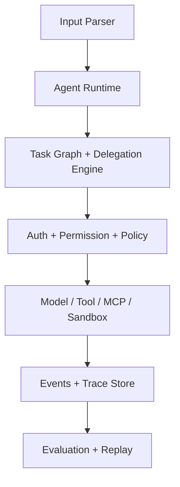
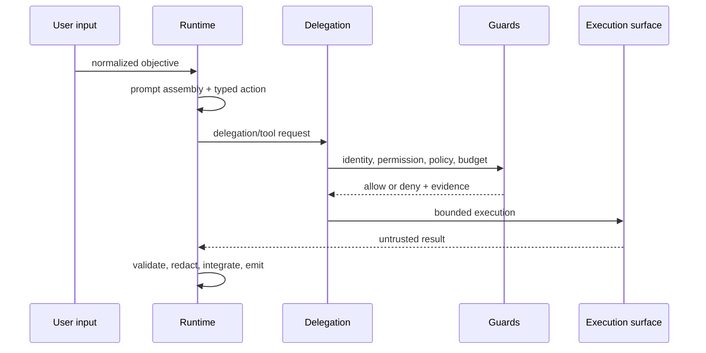

# Architecture

MAWL is an ESM TypeScript monorepo whose external boundaries are dependency-injected. The execution path remains provider-neutral and deterministic in local tests.

## Components

| Component         | Responsibility                                                                                                 |
| ----------------- | -------------------------------------------------------------------------------------------------------------- |
| Agent Runtime     | Assembles prompts, accepts only typed actions, enforces turn/error/token/time limits                           |
| Task Graph        | Maintains parent/root identity, dependencies, status, fan-out/fan-in, and loop checks                          |
| Delegation Engine | Validates target, capability, depth, ancestry, context, permissions, and budget before child creation          |
| Tool Executor     | Resolves immutable manifests, validates input/output, enforces allowlists/policy/approval, redacts and records |
| MCP Layer         | Uses official MCP client transports or an in-memory mock and treats all responses as untrusted                 |
| Sandbox           | Runs allowlisted commands through a provider interface and emits auditable lifecycle events                    |
| Authentication    | Produces runtime-issued principals and execution identities                                                    |
| Permission Engine | Applies explicit grants/denials and blocks child escalation                                                    |
| Policy Engine     | Applies contextual deny-before-allow rules and default deny                                                    |
| Prompt Processor  | Resolves semantic versions/hashes and preserves trusted/untrusted layer provenance                             |
| Input Parser      | Normalizes JSON, YAML, Markdown, text, and structured tasks without making them executable                     |
| Observability     | Records events, traces, JSON logs, metrics, usage/cost, budgets, approvals, and monitor alerts                 |
| Evaluation        | Applies deterministic rules, eight delegation dimensions, assertions, YAML specs, and optional judges          |
| Replay            | Reconstructs exact state or selectively reruns model/tools with side-effect gates                              |

## Runtime lifecycle

The exact lifecycle is: input normalization → workflow/run/task creation → root prompt/model call → typed action validation or static step scheduling → delegation policy → reduced context/permissions/budget → child execution → tool/MCP/sandbox guards → result integration → reviewer/evaluator → persisted trace → deterministic delegation score.

## Evidence model

`WorkflowRun → Task → AgentExecution → ToolCall / Child Task` is linked by workflow, root-task, parent-task, trace, span, agent, and call identifiers. A `delegation.created` record retains delegator/delegate, reason, capability match, passed/omitted context, granted/withheld permissions, requested/granted budget, depth, and policy decision. `delegation.result.accepted` records integration.

## Evaluation and observability

`DelegationEvaluator` consumes an immutable snapshot rather than influencing runtime authority. Its eight dimension scores are normalized diagnostics. Rule violations include evidence and recommended remediation. `ObservabilityManager` subscribes to `EventBus`, derives metrics/logs, runs eight monitors, and signals termination-worthy alerts to embedding applications.

## Replay boundary

Exact and dry-run modes perform no execution. Model-rerun invokes only the supplied model callback. Tool-rerun invokes the tool callback, but write/send/delete/create/update/payment/publish/shell-like tools and manifests marked `external_side_effect` require an exact tool-name permission. Production adapters should additionally use idempotency keys and an isolated replay environment.

## Extension interfaces

`ModelProvider`, `RuntimeStore`, `EventSink`, `ApprovalProvider`, `RuleEvaluator`, `RuntimeMonitor`, `McpConnection`/`McpConnector`, `SandboxProvider`, `AuthenticationProvider`, and `ToolDefinition` are stable seams. Local/mock implementations and tests cover each unavailable production dependency.
