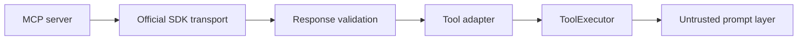

# MCP

The MCP client layer uses the official stable TypeScript SDK v2 packages (`@modelcontextprotocol/client` 2.x), with Streamable HTTP and stdio transports. YAML server definitions expose transport, explicit environment, permissions, trust state, allowlisted tools, and timeout.

## Trust boundary

MCP servers are external principals. Discovery does not authorize execution. A discovered tool is filtered by the server allowlist, adapted into a normal `ToolDefinition`, assigned risk metadata, and subjected to the same schema, permission, policy, timeout, redaction, and audit pipeline as a local tool. Results return to the model only as untrusted data.

Malformed tool results without `content` or `structuredContent` fail with `MCP_MALFORMED_RESPONSE`. Connections track `disconnected`, `connecting`, `connected`, `failed`, and `closed` states. Resources and prompts use separate adapters and do not bypass the trust model.

The sample `mcp-servers/public-search.yaml` is inspection-only and uses a non-routable placeholder URL.
