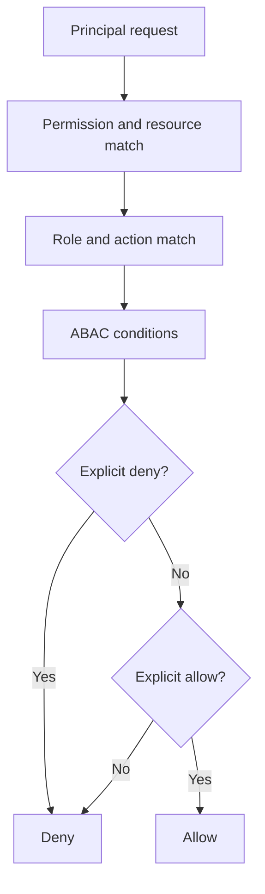

# Permissions

`PermissionEngine` combines RBAC, capability-style grants, ABAC conditions, action filters, and resource scopes. All unmatched requests are denied.

Deny wins over allow. Permission strings and resources support bounded glob matching. Conditions compare declared context attributes only.

Delegation is least-privilege intersection. A child can receive only permissions held by the parent and accepted by the child profile. Explicitly requested permissions are checked before child creation. `delegable: true` is required in the generic engine; an agent definition must also possess the requested permission. Budgets are clamped to the parent ceiling.

Every evaluation creates a `PermissionDecisionRecord` containing principal, permission, resource, action, result, reason, matched policy, and timestamp. Tool and runtime layers emit these records into the trace.
