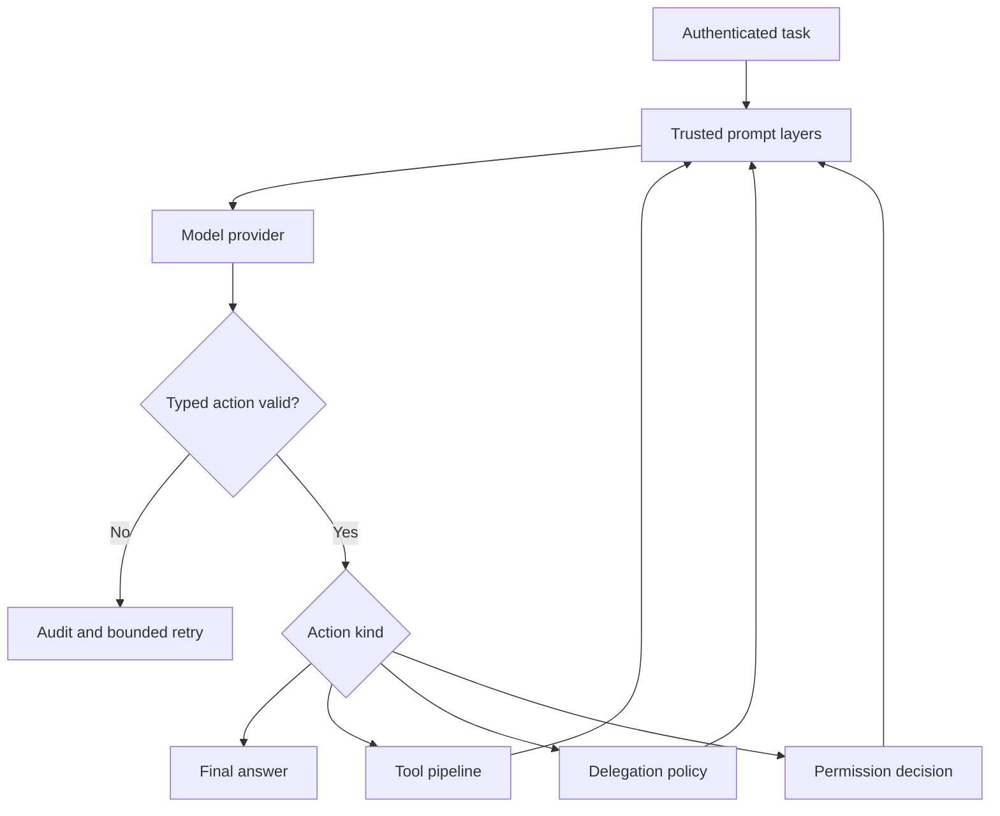

# Runtime

The runtime exposes a typed agent action loop and a deterministic local task scheduler alongside the declarative workflow API.

## Agent action loop

`AgentRuntime` accepts an authenticated execution, assembles a provenance-aware prompt, asks a `ModelProvider` for one response, and validates that response against exactly four actions: `final_answer`, `tool_call`, `delegate_task`, or `request_permission`.

Malformed output is never interpreted as a tool call. It produces `agent.action.invalid`, consumes the configured error/retry budget, and is retried only while limits permit. Turns, tokens, tool calls, delegations, errors, retries, runtime, and output bytes are bounded.

## Local task scheduler

`TaskScheduler` maintains queued tasks and explicit dependencies. Each ready batch is sorted by task ID and launched concurrently. Fan-in tasks run only after every dependency completes. Failure, timeout, or cancellation prevents dependents from running; cancelling a parent also cancels queued descendants. Dependency cycles are rejected.

## Trace events

The runtime emits prompt provenance, parsed/invalid actions, tool decisions, permission decisions, delegation decisions, completion, cancellation, and failure events. `TraceTreeRenderer` builds the CLI task tree, while `HumanTraceRenderer` provides a chronological compatibility view.
