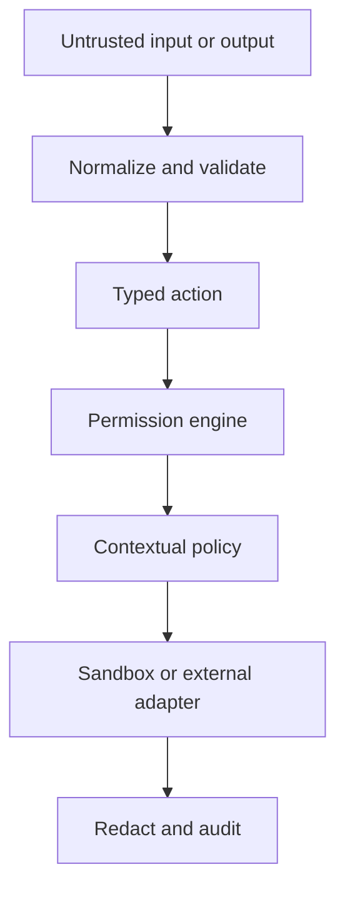

# Security Model

Protected assets are user authority, agent permissions, secrets, filesystem data, network access, external side effects, prompts, and audit evidence. Untrusted boundaries include model output, user input, child output, tool output, and every MCP response.

## Core invariants

- Default deny applies to unmatched permissions and policies.
- Only four schema-valid model actions can advance the action loop.
- A model response never grants its own permission.
- Child authority and budget cannot exceed the parent.
- Tools execute only after registry resolution, validation, permission, and policy checks.
- Secrets are resolved only for authorized tools, redacted afterward, and omitted from child context by default.
- MCP data is normalized and remains untrusted.
- All consequential decisions are traceable.

## Threat coverage

The security suite covers child escalation, unauthorized/unknown tools, dangerous and malformed MCP behavior, schema bypass, delegation escalation/depth/loops, traversal and symlink escape, secret leakage and transfer, tool timeout, sandbox overflow, prompt-template abuse, tool/MCP injection, malformed model actions, and unauthorized shell execution.

## Residual risk

Restricted local execution is not a kernel sandbox and cannot guarantee network isolation. Pattern-based prompt-injection detection can miss novel language. The local API-key provider is a development implementation. Streamable HTTP authentication and production OIDC remain deployment adapters. These limitations must not be described as stronger guarantees.
