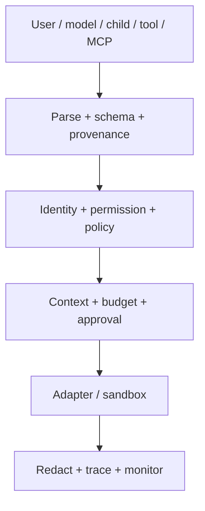

# Threat model

## Assets and trust boundaries

Protected assets are user authority, runtime identities, secrets, prompt policy, filesystem/network access, tool and MCP capabilities, external side effects, budgets, and audit evidence. User input and all model, child, tool, MCP, and resource output are untrusted. Prompt registry content, runtime policy, validated configuration, and runtime-issued identity are trusted only to the deployment boundary that supplies them.

## Threats and controls

| Threat                           | Primary controls                                                 | Residual limitation                                             |
| -------------------------------- | ---------------------------------------------------------------- | --------------------------------------------------------------- |
| Malicious user input             | normalization, untrusted prompt layer, typed actions             | semantic attacks may evade heuristic detection                  |
| Malicious agent output           | strict action schema, runtime-issued identity, allowlists        | a valid but poor action still needs evaluation                  |
| Malicious child agent            | reduced context/permissions/budget, ancestry limits              | child content can still contain misleading claims               |
| Malicious tool                   | manifest policy, schema/size/time limits, redaction, trace       | local handler code is inside the host trust boundary            |
| Malicious MCP server             | server/tool allowlists, untrusted marking, timeout/schema checks | remote semantics cannot be proven by schema alone               |
| Prompt injection                 | priority-separated prompt layers, indicators, policy gates       | detection is not complete or a formal guarantee                 |
| Secret leakage                   | secret references, default omission, redaction, exposure monitor | novel encodings and side channels remain possible               |
| Permission escalation            | parent-owned/delegable permission checks, default deny           | incorrect deployment grants remain dangerous                    |
| Sandbox escape                   | path/symlink checks, command allowlist, adapter boundary         | local process sandbox is not kernel isolation                   |
| Resource exhaustion              | workflow/task/agent budgets, timeouts, retry/depth/task monitors | distributed deployments need shared atomic counters             |
| Delegation loops                 | task ancestry, agent recursion, depth and task caps              | semantically equivalent loops across workflows need correlation |
| Unexpected external side effects | policy, approval, replay permission, audit                       | non-idempotent third-party APIs require provider safeguards     |

## Security invariants

- Model output never grants identity, permissions, secrets, tools, MCP servers, or budget.
- A child cannot receive authority or budget above its parent.
- Unmatched permissions and contextual policies deny by default.
- Tool execution occurs only after resolution, validation, permission, policy, and applicable approval.
- External-side-effect replay is blocked without explicit per-tool authorization.
- Protected and secret context is omitted unless both policy and participants explicitly permit it.
- Consequential allow/deny/execute/integrate decisions are append-only events.

The red-team corpus in `redteam/security-prompts.yaml` covers user/tool/MCP injection, child instruction replacement, secret requests, impersonation, escalation, recursion, exhaustion, exfiltration, and tool misuse.
