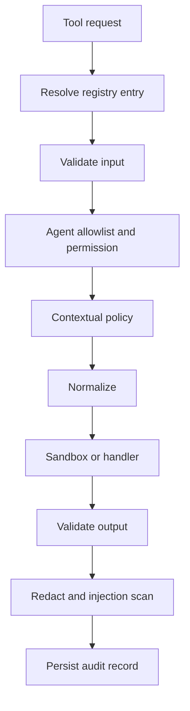

# Tools

Each `ToolDefinition` declares a stable name, provider, input/output schemas, required permissions, risk types and level, timeout, output limit, sandbox policy, normalization/sanitization hooks, and a handler or sandbox request.

Every denial or failure returns a controlled `ToolCall` record. Error codes are `VALIDATION_ERROR`, `PERMISSION_DENIED`, `POLICY_DENIED`, `SANDBOX_ERROR`, `TIMEOUT`, `TOOL_EXECUTION_ERROR`, `OUTPUT_VALIDATION_ERROR`, `UNKNOWN_TOOL`, and `CANCELLED`.

Unknown tools, invalid inputs, and invalid outputs never reach a handler. High and critical operations are denied by the default contextual policy unless an application supplies an explicit safe policy. Tool and MCP output remains untrusted in later prompts. Prompt-injection indicators improve audit visibility but do not grant authority.
